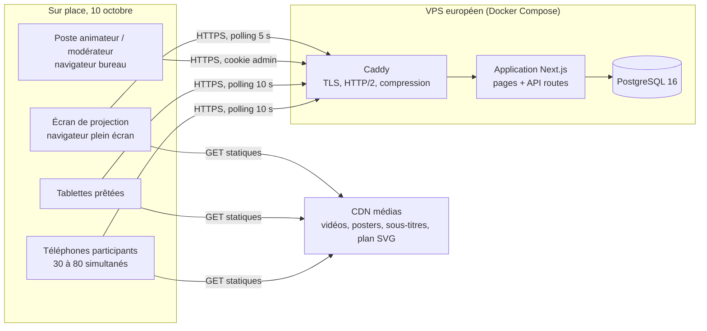
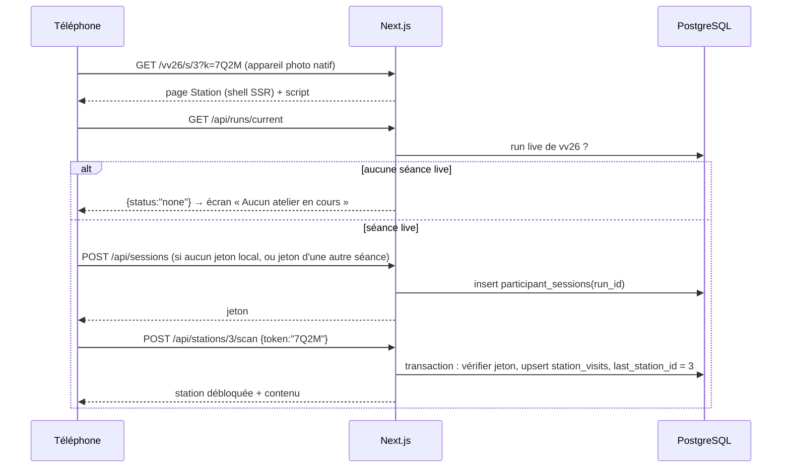

# 01 — Architecture

## 1. Vue d'ensemble



Un seul service applicatif. Le front participant, le front admin et l'API vivent dans la même application Next.js : un seul déploiement, un seul domaine, pas de CORS, un seul endroit à surveiller pendant l'astreinte.

## 2. Stack retenue

| Couche | Choix | Pourquoi | Alternative acceptable |
|---|---|---|---|
| Langage | TypeScript partout | Un seul langage, types partagés front/API (schémas Zod) | — |
| Framework | **Next.js 15** (App Router, Route Handlers) | Pages mobiles + pages bureau + API dans un seul projet ; SSR pour le premier affichage sur 4G ; équipe web standard | SvelteKit (même découpage) |
| UI | React 19 + Tailwind CSS | Rapidité pour reproduire la maquette ; tokens de la charte en config Tailwind | CSS modules |
| Validation | Zod | Schémas partagés requête/réponse, génération des types | Valibot |
| Base de données | **PostgreSQL 16** | JSONB pour `Answer.value` et `text_i18n`, index partiels, transactions pour le scan et la réponse | — |
| ORM / migrations | Prisma (migrations SQL versionnées) | Migrations reproductibles, client typé | Drizzle |
| Auth admin | Sessions serveur maison (table `admin_sessions`) + Argon2id (`@node-rs/argon2`) | Pas de fournisseur externe, modèle simple à auditer | Lucia |
| Tests | Vitest (unitaire, API), Playwright (E2E, mobile 360 px), k6 (charge) | Standard, rapide | — |
| Médias | Fichiers statiques sur **Bunny CDN** (zone de stockage EU) ou Cloudflare R2 + cache | 2 Go servis en 30 min sans toucher au VPS | Dossier `public/` derrière Caddy si le CDN n'est pas prêt (solution de secours, voir § 7) |
| Hébergement | VPS 2 vCPU / 4 Go (Hetzner Falkenstein ou Scaleway Paris), Docker Compose | UE, coût faible, contrôle total pendant l'astreinte | Vercel région `fra1` + Neon EU (moins de contrôle, démarrage plus rapide) |
| Reverse proxy | Caddy | TLS automatique, HTTP/2, zéro config | Nginx |
| Observabilité | Logs JSON sur stdout (pino) + `GET /api/health` + Sentry (optionnel) | Suffisant pour un événement d'une journée | — |

> Hypothèse à valider par l'équipe (ligne « stack maîtrisée » du cahier). Si l'équipe est Python, le même découpage se transpose en Django + HTMX sans changer le modèle de données ni l'API.

## 3. Arborescence du dépôt

```
vice-versa/
├── docs/conception/            # ce dossier
├── content/vv26/               # contenu versionné (voir 07)
│   ├── event.json
│   ├── stations.json           # inclut qr_token et short_code figés
│   ├── questions.json
│   ├── media.json
│   ├── captions/VV-V10.fr.json, VV-V10.fr.vtt, …
│   ├── banned-words.txt
│   └── map.svg
├── messages/fr.json, nl.json, en.json   # textes d'interface
├── prisma/schema.prisma, migrations/
├── src/
│   ├── app/
│   │   ├── (participant)/vv26/…          # routes participant (05)
│   │   ├── admin/…                       # routes administration (06)
│   │   ├── projection/[runId]/page.tsx
│   │   └── api/…                         # Route Handlers (04)
│   ├── components/                       # VideoPlayer, CaptionsOverlay, VenueMap, QuestionForm, …
│   ├── lib/
│   │   ├── db.ts                         # client Prisma
│   │   ├── auth/                         # sessions admin, rôles, rate limit
│   │   ├── participant/                  # résolution du jeton, règles de phase
│   │   ├── domain/                       # progression, agrégation, normalisation des mots, machine à états
│   │   └── content/                      # chargement et validation de content/
│   └── i18n/
├── scripts/
│   ├── seed.ts                 # charge content/ en base
│   ├── qr-generate.ts          # génère jetons, codes courts, PNG et planche d'affiches
│   ├── captions/               # extraction audio, appel Groq, traduction, génération json/vtt
│   ├── create-admin.ts         # crée le premier compte admin
│   └── load-test.k6.js
├── tests/unit/, tests/api/, tests/e2e/
├── docker-compose.yml, Dockerfile, Caddyfile
└── .env.example
```

## 4. Configuration (variables d'environnement)

| Variable | Rôle |
|---|---|
| `DATABASE_URL` | PostgreSQL |
| `APP_BASE_URL` | `https://viceversa.example.be` — utilisée dans les QR et les liens |
| `MEDIA_BASE_URL` | Préfixe CDN des médias |
| `SESSION_SECRET` | Clé HMAC des jetons (participants et admin) |
| `ADMIN_BOOTSTRAP_EMAIL` / `ADMIN_BOOTSTRAP_PASSWORD` | Création du premier compte admin au premier démarrage si la table est vide (puis ignorées) |
| `RATE_LIMIT_PARTICIPANT_PER_MIN` | Défaut 120 requêtes / jeton / minute |
| `RETENTION_MONTHS` | Défaut 12 : purge des données participants des séances clôturées |
| `SENTRY_DSN` | Optionnel |

Pas de clé Groq dans l'application : les scripts de sous-titrage tournent sur un poste de l'équipe, avant l'événement.

## 5. Flux principaux

### 5.1 Scan d'une station



### 5.2 Lancement d'une nouvelle séance par l'admin

1. L'admin crée la séance « Test interne 2 » (`draft`).
2. Il clique **Lancer** : le serveur vérifie qu'aucune autre séance de `vv26` n'est `live` (index unique partiel), passe la séance en `live` / `accueil`, journalise.
3. Les téléphones qui gardaient un jeton de la séance précédente reçoivent `409 RUN_CHANGED` à leur prochain appel ; le client efface son jeton et se recrée une session sur la nouvelle séance (la langue est conservée).
4. Le tableau de bord de la nouvelle séance démarre à 0 session.

### 5.3 Arrêt

**Stopper** passe la séance en `closed`, phase `cloture`, calcule `runs.summary` (agrégats figés), journalise. Les participants voient « Merci », plus aucune saisie. Les exports restent disponibles.

## 6. Exploitation

- **Déploiement** : `docker compose up -d` (services `app`, `db`, `caddy`). Image Next.js `standalone`. Migrations Prisma lancées au démarrage du conteneur `app`.
- **Sauvegardes** : `pg_dump` toutes les nuits + **un dump manuel juste avant de lancer la séance `live` du 10 octobre** (bouton « Sauvegarde » dans l'admin qui déclenche le dump, ou commande documentée).
- **Santé** : `GET /api/health` vérifie la base et renvoie la séance live et sa phase ; surveillé par un ping externe toutes les minutes pendant l'événement.
- **Capacité** : 80 participants × 1 requête / 10 s = 8 req/s de polling plus les scans et réponses ; largement sous ce que tient une instance Node + Postgres. Le trafic lourd (vidéos) ne touche pas le VPS.
- **Astreinte jour J** : accès SSH, `docker compose logs -f app`, tableau de bord admin ouvert, procédure de bascule « médias locaux » (§ 7).

## 7. Plans de secours

| Risque | Parade |
|---|---|
| CDN indisponible | `MEDIA_BASE_URL` peut pointer vers `/media/` servi par Caddy depuis le VPS ; les fichiers y sont aussi copiés (2 Go en 30 min tiennent sur un VPS avec 1 Gbit/s, c'est dégradé mais fonctionnel) |
| Wi-Fi de la salle saturé | Les affiches portent le code court : la 4G suffit, l'app pèse peu hors vidéos |
| Base de données corrompue | Restauration du dump d'avant-séance ; une nouvelle séance est créée, les participants repartent de zéro (règle 3) |
| Mauvaise manipulation de phase | Les phases se changent dans les deux sens avec confirmation en arrière ; tout est journalisé |
| Animateur sans accès | Un compte `admin` peut tout faire ; mot de passe réinitialisable par un autre admin |
