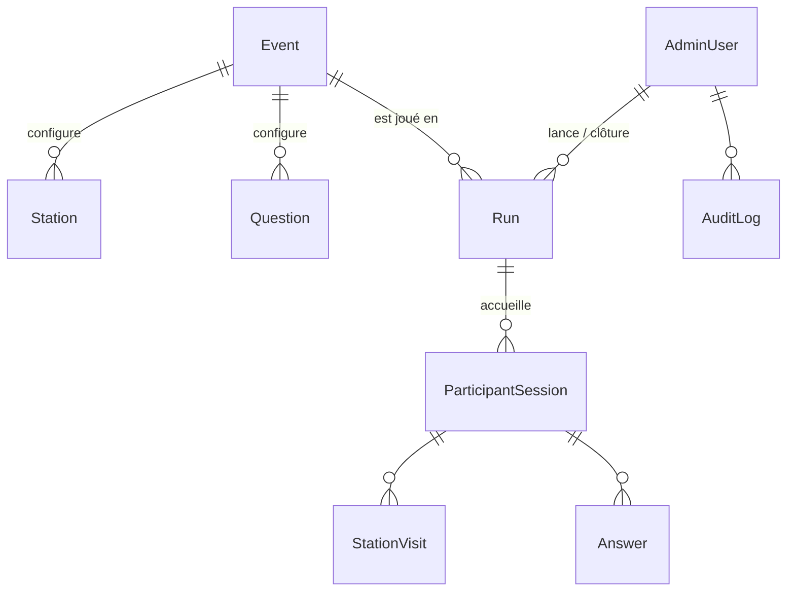
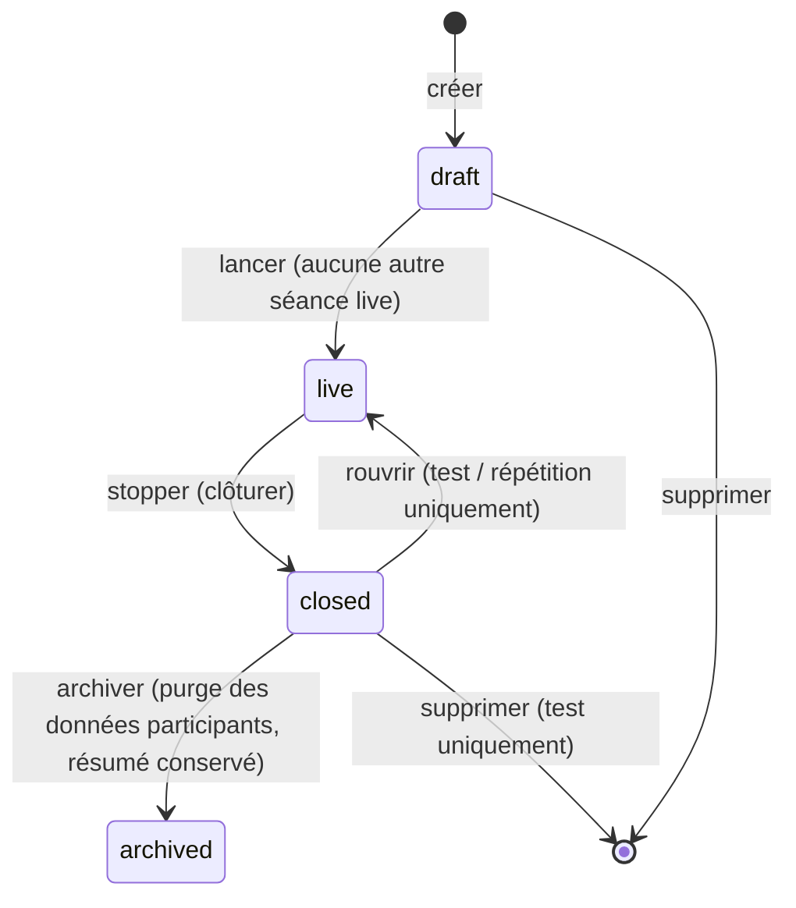
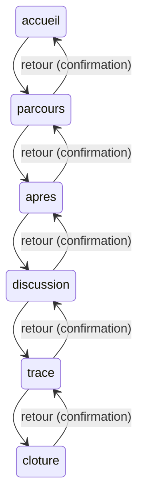

# 02 — Séances et cycle de vie

## 1. Pourquoi séparer Événement et Séance

Le cahier v3 porte la phase directement sur `Event.state`. Cela ne permet qu'une seule exécution. Or l'atelier sera joué au moins quatre fois avant et pendant le 10 octobre (tests développeurs, test sur appareils du 8, répétition générale du 9, jour J), puis dans des éditions futures.

La conception introduit donc la **Séance (`Run`)** :

- **L'Événement** est du contenu : il change rarement, il est chargé depuis `content/vv26/`, et ses jetons QR sont figés une fois les affiches imprimées.
- **La Séance** est de l'activité : elle naît, se lance, avance de phase en phase, se clôture. Toutes les données participants lui appartiennent.
- Supprimer ou réinitialiser une séance de test ne touche jamais au contenu ni aux autres séances.

## 2. Cycle de vie d'une séance

| Statut | Participants | Pilotage |
|---|---|---|
| `draft` | Invisible. Un scan voit « Aucun atelier en cours » (sauf si une autre séance est live) | Modifier libellé, type, notes, date prévue |
| `live` | Toute l'application fonctionne selon la phase | Changer de phase, modérer, projeter, exporter, stopper, réinitialiser (test) |
| `closed` | Écran « Merci » ; toute écriture refusée (`409 RUN_CLOSED`) | Exporter, consulter le tableau de bord figé, rouvrir si test / répétition, archiver |
| `archived` | Idem `closed` | Lecture du résumé agrégé seulement |

### Types de séance (`Run.kind`)

| Type | Usage | Particularités |
|---|---|---|
| `test` | Tests de l'équipe | Bandeau « SÉANCE DE TEST » discret côté participant ; réinitialisable et supprimable sans restriction ; rouvrable |
| `repetition` | Répétition générale du 9 octobre | Comme `test`, sans bandeau |
| `live` | L'événement | Pas de bandeau ; réinitialisation uniquement tant qu'il n'y a aucune session (sinon refusée) ; pas de réouverture ; pas de suppression |

## 3. Phases (inchangées par rapport au cahier)

Le passage est toujours manuel. Le bouton « phase suivante » est mis en avant ; un retour en arrière demande une confirmation et reste journalisé. Passer en `cloture` ne clôture pas la séance : c'est **Stopper** qui le fait (la séance peut rester en `cloture` quelques minutes pendant que l'animateur conclut).

### Matrice des écritures autorisées par phase

| Écriture | accueil | parcours | apres | discussion | trace | cloture |
|---|:-:|:-:|:-:|:-:|:-:|:-:|
| Créer une session | ✔ | ✔ | ✔ | ✔ | ✔ | ✘ |
| Scanner une station (déblocage) | ✔ | ✔ | ✔ | lecture seule¹ | lecture seule¹ | ✘ |
| Répondre aux questions « Avant » | ✔ | ✔ | ✔ | ✘ | ✘ | ✘ |
| Répondre aux questions de station | ✘² | ✔ | ✔ | ✘ | ✘ | ✘ |
| Répondre aux questions « Après » | ✘ | ✘ | ✔ | ✔ | ✔ | ✘ |
| Laisser la trace « Je repars avec… » | ✘ | ✘ | ✘ | ✔ | ✔ | ✘ |

¹ Le scan réussit (la station s'ouvre, les médias sont lisibles) mais ne crée pas de visite « en cours » et ne change pas la progression.
² En `accueil`, un scan débloque la station et affiche le média, la question apparaît quand l'animateur passe en `parcours`. Cas marginal (participant en avance) ; l'écran l'explique.

Toute écriture hors matrice renvoie `423 PHASE_LOCKED` avec la phase courante : le client affiche « Cette étape est fermée » et se resynchronise.

## 4. Session participant et changement de séance

Le jeton stocké dans le navigateur encode l'identifiant de la séance : `v1.<run_id>.<aléa>`. À chaque requête authentifiée, le serveur vérifie :

1. le hachage du jeton existe dans `participant_sessions` ;
2. `participant_sessions.run_id` est la séance `live` de l'événement.

Sinon :

| Situation | Réponse | Comportement client |
|---|---|---|
| Jeton inconnu (base restaurée, falsification) | `401 SESSION_UNKNOWN` | Efface le jeton, recrée une session |
| La séance du jeton est `closed`/`archived` et une autre est `live` | `409 RUN_CHANGED` | Efface le jeton, recrée une session sur la séance live, garde la langue, revient à l'accueil |
| La séance du jeton est `closed` et aucune n'est live | `409 RUN_CLOSED` | Affiche « Merci, l'atelier est terminé » (lecture seule du bilan si disponible) |
| Aucune séance live et aucun jeton | — (`GET /api/runs/current` → `none`) | Écran « Aucun atelier en cours » |

Le client interroge `GET /api/runs/current` toutes les 10 secondes ; si `run_id` diffère de celui du jeton, il applique la même logique sans attendre une erreur.

## 5. Règles de gestion conservées du cahier

Reprises ici pour que ce dossier soit auto-suffisant côté développeurs ; le cahier reste la référence.

- Une station se débloque **uniquement** par le scan de son QR ou la saisie de son code court (MVP-02, MVP-10, MVP-11).
- « Je suis ici » = dernière station ouverte par QR ou code (`last_station_id`). Rouvrir depuis la liste ou la carte ne le déplace pas. Jamais de GPS.
- Progression = stations terminées ÷ 8, arrondi à l'entier. A et Z ne comptent pas (`counts_in_progress = false`).
- Une station est **terminée** quand sa question obligatoire est envoyée ; une station `media_only` est terminée quand le média est lu à 80 %.
- La dernière réponse remplace la précédente (unicité `(session_id, question_id)`).
- Les 7 types de questions et leurs formats de `value` sont ceux du cahier (voir 03 § 5).
- Les mots libres (`three_words`) sont normalisés côté serveur : minuscules, sans accents, dédoublonnés, filtrés par la liste de mots interdits.
- Les textes libres (`short_text`, commentaires de `tri_state`, trace) sont `pending` jusqu'à modération ; rien n'est projeté sans validation (MVP-15).
- Après avoir répondu à une question fermée, le participant voit un agrégat simple ; jamais les réponses libres des autres.

## 6. Règles nouvelles liées aux séances

- **R-S1** : au plus une séance `live` par événement, garanti par un index unique partiel en base, pas seulement par l'interface.
- **R-S2** : **Lancer** refuse si une autre séance est `live` (`409 ANOTHER_RUN_LIVE`, avec son libellé) ; l'admin doit la stopper d'abord. Pas de bascule implicite.
- **R-S3** : **Stopper** fige `summary` (agrégats par question, nombre de sessions, progression moyenne, répartition Avant/Après) dans une transaction, puis passe en `closed`.
- **R-S4** : **Réinitialiser** supprime sessions, visites et réponses de la séance, remet la phase à `accueil`, garde le statut. Interdit sur une séance `live` de type `live` qui a déjà des sessions.
- **R-S5** : **Archiver** supprime les données participants et garde `summary`, les exports agrégés et le journal. Un travail planifié archive automatiquement les séances `closed` depuis plus de `RETENTION_MONTHS` mois.
- **R-S6** : toute action de pilotage (créer, lancer, phase, stopper, rouvrir, réinitialiser, archiver, modérer, exporter, changer de diapositive) écrit une ligne dans `audit_log` avec l'auteur.
- **R-S7** : une séance de type `test` affiche un bandeau « Séance de test » dans l'application participant et dans le titre de l'onglet admin, pour qu'un testeur ne confonde jamais avec le jour J.
- **R-S8** : la clé de projection (`projection_key`) est propre à chaque séance ; l'URL de projection d'une séance de test ne montre jamais une autre séance.
