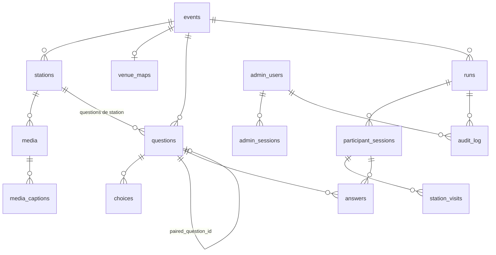

# 03 — Modèle de données (PostgreSQL)

Le modèle du cahier v3 est conservé et étendu : `Spot` devient `Station`, `Event.state` devient `Run.phase`, les données participants sont rattachées à une séance, et les tables d'administration apparaissent. Le schéma source est `src/db/schema/*.ts` (Drizzle) et les migrations générées sont dans `drizzle/` ; ce DDL en est la lecture SQL. Deux écarts volontaires dans l’implémentation : les hachages de jetons sont stockés en `text` hexadécimal plutôt qu’en `bytea`, et `admin_users.email` est un `text` normalisé en minuscules par l’application plutôt qu’un `citext`. Les tables `questions`, `choices` et `media` portent aussi une colonne `active` pour désactiver sans supprimer.

## 1. Schéma d'ensemble



## 2. Types énumérés

```sql
create extension if not exists citext;
create extension if not exists pgcrypto;

create type run_kind          as enum ('test', 'repetition', 'live');
create type run_status        as enum ('draft', 'live', 'closed', 'archived');
create type event_phase       as enum ('accueil', 'parcours', 'apres', 'discussion', 'trace', 'cloture');
create type question_phase    as enum ('avant', 'station', 'apres', 'trace');
create type question_type     as enum ('single_choice', 'multi_choice', 'tri_state', 'three_words',
                                       'short_text', 'guess_reveal', 'media_only');
create type media_type        as enum ('video', 'image', 'audio');
create type consent_status    as enum ('pending', 'granted', 'refused');
create type caption_source    as enum ('whisper', 'manual', 'translation');
create type caption_status    as enum ('auto', 'reviewed');
create type opened_via        as enum ('qr', 'code', 'list');
create type visit_status      as enum ('in_progress', 'completed');
create type moderation_status as enum ('not_required', 'pending', 'approved', 'rejected');
create type admin_role        as enum ('admin', 'animateur', 'moderateur');
```

## 3. Contenu (stable entre les séances)

```sql
create table events (
  id                 serial primary key,
  slug               text not null unique,                 -- 'vv26'
  name               text not null,
  languages          text[] not null default '{fr,nl,en}',
  default_lang       text not null default 'fr',
  required_stations  int  not null default 8,
  tokens_frozen_at   timestamptz,                          -- posé après impression des affiches
  content_version    text,                                 -- hash du dossier content/ chargé
  created_at         timestamptz not null default now(),
  updated_at         timestamptz not null default now()
);

create table venue_maps (
  id        serial primary key,
  event_id  int not null unique references events(id) on delete cascade,
  svg_url   text not null,
  width     int not null,                                  -- largeur logique du viewBox
  height    int not null
);

create table stations (
  id                  serial primary key,
  event_id            int  not null references events(id) on delete cascade,
  code                text not null,                       -- 'A', '1'..'8', 'Z'
  position            int  not null,                       -- ordre d'affichage 0..9
  slug                text not null,
  title_i18n          jsonb not null,                      -- {"fr": "...", "nl": "...", "en": "..."}
  intro_i18n          jsonb,
  qr_token            text not null,                       -- ≥ 8 caractères, non devinable
  short_code          text not null,                       -- 4 caractères affichés sous le QR
  x_pct               numeric(5,2),                        -- position sur le plan, 0..100
  y_pct               numeric(5,2),
  counts_in_progress  boolean not null default true,       -- false pour A et Z
  active              boolean not null default true,
  unique (event_id, code),
  unique (event_id, qr_token),
  unique (event_id, short_code)
);

create table media (
  id              serial primary key,
  station_id      int not null references stations(id) on delete cascade,
  ref             text not null,                           -- 'VV-V10' (catalogue du cahier)
  type            media_type not null,
  url             text not null,
  poster_url      text,
  duration_s      numeric(6,2),
  orientation     text not null default 'portrait',
  consent_status  consent_status not null default 'pending',
  credits         text,
  position        int not null default 0,
  unique (station_id, ref)
);

create table media_captions (
  id              serial primary key,
  media_id        int not null references media(id) on delete cascade,
  lang            text not null,
  words_json_url  text not null,                           -- captions.<lang>.json
  vtt_url         text not null,
  source          caption_source not null,
  status          caption_status not null default 'auto',
  unique (media_id, lang)
);

create table questions (
  id                  serial primary key,
  event_id            int not null references events(id) on delete cascade,
  key                 text not null,                       -- 'avant_futur', 's3_motivation', … stable, utilisé par content/
  station_id          int references stations(id) on delete cascade,  -- null pour avant/apres/trace
  phase               question_phase not null,
  type                question_type not null,
  text_i18n           jsonb not null,
  help_i18n           jsonb,
  required            boolean not null default true,
  min_choices         int,
  max_choices         int,
  max_length          int,                                 -- short_text : 140
  paired_question_id  int references questions(id),       -- question Avant liée (sur la question Après)
  position            int not null default 0,
  unique (event_id, key),
  check ((phase = 'station') = (station_id is not null))
);

create table choices (
  id           serial primary key,
  question_id  int not null references questions(id) on delete cascade,
  key          text not null,                              -- 'afrique', 'oui', 'kinshasa', …
  label_i18n   jsonb not null,
  is_correct   boolean,                                    -- guess_reveal uniquement
  icon         text,                                       -- station 8 : nom d'icône
  position     int not null default 0,
  unique (question_id, key)
);
```

Les identifiants techniques (`serial`) sont internes. Le contenu versionné référence les stations par `code` et les questions/choix par `key`, ce qui rend le rechargement de `content/` idempotent.

## 4. Administration

```sql
create table admin_users (
  id                    uuid primary key default gen_random_uuid(),
  email                 citext not null unique,
  display_name          text not null,
  password_hash         text not null,                     -- Argon2id
  role                  admin_role not null,
  active                boolean not null default true,
  must_change_password  boolean not null default false,
  created_at            timestamptz not null default now(),
  last_login_at         timestamptz
);

create table admin_sessions (
  id          uuid primary key default gen_random_uuid(),
  user_id     uuid not null references admin_users(id) on delete cascade,
  token_hash  bytea not null unique,                       -- sha256 du cookie
  expires_at  timestamptz not null,
  created_at  timestamptz not null default now(),
  ip          inet,
  user_agent  text
);
create index on admin_sessions (user_id);

create table audit_log (
  id         bigserial primary key,
  at         timestamptz not null default now(),
  actor_id   uuid references admin_users(id) on delete set null,
  run_id     uuid,                                         -- FK ajoutée après création de runs
  action     text not null,   -- run.create | run.start | run.phase | run.close | run.reopen | run.reset
                              -- run.archive | run.delete | answer.moderate | slide.set | export
                              -- user.create | user.update | auth.login | auth.failed | content.reload
  payload    jsonb
);
create index on audit_log (run_id, at desc);
```

## 5. Séances et données participants

```sql
create table runs (
  id              uuid primary key default gen_random_uuid(),
  event_id        int not null references events(id),
  label           text not null,                           -- 'Répétition générale 9 oct'
  kind            run_kind not null default 'test',
  status          run_status not null default 'draft',
  phase           event_phase not null default 'accueil',
  projection_key  text not null,                           -- aléatoire, 24 car., pour /projection/{id}?key=
  current_slide   jsonb,                                   -- {"kind":"before_after","question_key":"avant_futur"}
  scheduled_at    timestamptz,
  started_at      timestamptz,
  started_by      uuid references admin_users(id),
  closed_at       timestamptz,
  closed_by       uuid references admin_users(id),
  summary         jsonb,                                   -- agrégats figés à la clôture
  notes           text,
  created_by      uuid references admin_users(id),
  created_at      timestamptz not null default now(),
  updated_at      timestamptz not null default now()
);
-- R-S1 : une seule séance live par événement
create unique index runs_one_live_per_event on runs (event_id) where status = 'live';
create index on runs (event_id, created_at desc);
alter table audit_log add foreign key (run_id) references runs(id) on delete set null;

create table participant_sessions (
  id               uuid primary key default gen_random_uuid(),
  run_id           uuid not null references runs(id) on delete cascade,
  token_hash       bytea not null unique,                  -- sha256 du jeton remis au navigateur
  lang             text not null default 'fr',
  last_station_id  int references stations(id),
  created_at       timestamptz not null default now(),
  last_seen_at     timestamptz not null default now(),
  completed_at     timestamptz                             -- première fois à 8/8
);
create index on participant_sessions (run_id, last_seen_at desc);

create table station_visits (
  session_id    uuid not null references participant_sessions(id) on delete cascade,
  station_id    int  not null references stations(id),
  run_id        uuid not null references runs(id) on delete cascade,   -- dénormalisé pour le tableau de bord
  opened_at     timestamptz not null default now(),
  opened_via    opened_via not null,
  status        visit_status not null default 'in_progress',
  completed_at  timestamptz,
  media_progress numeric(4,3),                             -- 0..1, pour media_only
  primary key (session_id, station_id)
);
create index on station_visits (run_id, station_id, status);

create table answers (
  id                 bigserial primary key,
  run_id             uuid not null references runs(id) on delete cascade,   -- dénormalisé
  session_id         uuid not null references participant_sessions(id) on delete cascade,
  question_id        int  not null references questions(id),
  value              jsonb not null,
  value_normalized   jsonb,                                -- three_words : mots normalisés ; short_text : texte nettoyé
  moderation_status  moderation_status not null default 'not_required',
  moderated_by       uuid references admin_users(id),
  moderated_at       timestamptz,
  created_at         timestamptz not null default now(),
  updated_at         timestamptz not null default now(),
  unique (session_id, question_id)
);
create index on answers (run_id, question_id);
create index answers_pending on answers (run_id, updated_at) where moderation_status = 'pending';
```

`FinalMessage` du cahier est bien une `answers` sur la question de phase `trace`.

### Format de `answers.value` par type (inchangé du cahier)

| `question_type` | `value` | `moderation_status` initial |
|---|---|---|
| `single_choice` | `{"choice_id": 12}` | `not_required` |
| `multi_choice` | `{"choice_ids": [3, 7]}` (bornes `min_choices`/`max_choices`) | `not_required` |
| `tri_state` | `{"choice_id": 2, "comment": "…"}` | `pending` si `comment` non vide, sinon `not_required` |
| `three_words` | `{"words": ["chaleur", "famille", "bruit"]}` → `value_normalized.words` | `not_required` (filtre mots interdits à la saisie) |
| `short_text` | `{"text": "…"}` ≤ `max_length` | `pending` |
| `guess_reveal` | `{"choice_id": 1, "correct": false}` (`correct` recalculé serveur) | `not_required` |
| `media_only` | aucune ligne ; la complétion passe par `station_visits.media_progress ≥ 0.8` | — |

## 6. Invariants et calculs

- **Progression d'une session** : `count(station_visits where status='completed' and station.counts_in_progress) / events.required_stations × 100`, arrondi. Calculée à la lecture ; pas de colonne stockée.
- **Complétion d'une station** (dans la transaction de `PUT /api/answers/{id}`) : si la question est `required` et de phase `station`, alors `station_visits.status := 'completed'` pour `(session, station)`. Une visite doit exister (sinon `403 STATION_LOCKED`) : impossible de répondre sans avoir scanné.
- **Agrégats** : requêtes SQL par `(run_id, question_id)` ; pour `three_words`, `jsonb_array_elements_text(value_normalized->'words')` groupé et compté ; pour les textes, uniquement `moderation_status = 'approved'`.
- **`runs.summary`** (figé à la clôture) :

```json
{
  "sessions": 74,
  "sessions_completed": 51,
  "avg_progress": 81,
  "stations": {"1": {"opened": 70, "completed": 66}, "…": {}},
  "questions": {
    "avant_futur": {"type": "single_choice", "total": 71, "choices": {"afrique": 12, "europe": 40, "ailleurs": 14, "nsp": 5}},
    "apres_futur": {"type": "single_choice", "total": 58, "choices": {"afrique": 19, "europe": 29, "ailleurs": 8, "nsp": 2}, "paired_with": "avant_futur"}
  },
  "approved_texts": {"s6_tradition": ["…"], "trace": ["…"]},
  "computed_at": "2026-10-10T17:42:00Z"
}
```

## 7. Rétention

| Donnée | Durée | Mécanisme |
|---|---|---|
| `participant_sessions`, `station_visits`, `answers` d'une séance `closed` | `RETENTION_MONTHS` (12) | Tâche quotidienne : passe la séance en `archived` et supprime en cascade |
| `runs.summary`, exports agrégés | Illimitée | — |
| `audit_log` | 24 mois | Tâche quotidienne |
| `admin_sessions` expirées | Immédiat | Tâche quotidienne |
| Séances `test` | À la main | Bouton Supprimer |
