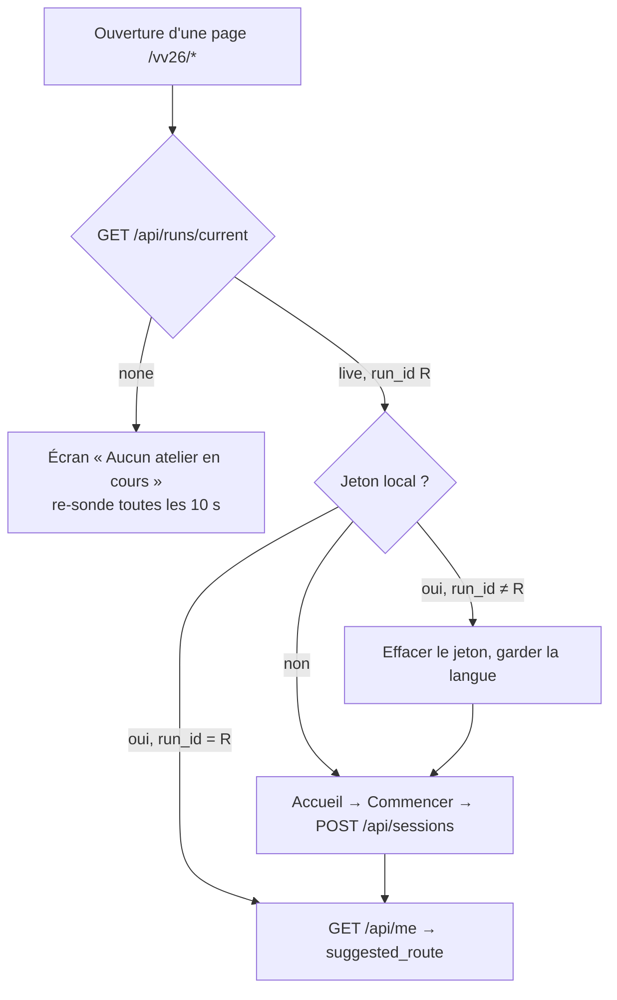

# 05 — Frontend

Le prototype cliquable fait foi pour l'apparence ; le cahier fait foi pour les règles ; ce document fixe la structure technique.

## 1. Routes

### Participant (mobile, 360 px minimum)

| Route | Écran | Barre d'onglets | Notes |
|---|---|---|---|
| `/vv26` | Accueil | non | Logo, consigne, choix FR / NL / EN, « aucune donnée personnelle », bouton Commencer ou Reprendre. Si aucune séance live : « Aucun atelier en cours » |
| `/vv26/avant` | Questions « Avant » | non | 3 questions, barre 1/3 à 3/3 |
| `/vv26/parcours` | Parcours | oui | Bandeau « X/8 stations », progression, dernier scan, liste des stations avec pastille, bandeau « questions finales ouvertes » en phase `apres` |
| `/vv26/carte` | Carte | oui | Plan SVG, légende des 4 états, pastilles, pin « Je suis ici » |
| `/vv26/scanner` | Saisir un code | oui | Consigne appareil photo, champ 4 caractères, erreur « Code inconnu » |
| `/vv26/s/{code}` | Station | oui | Arrivée QR : `?k=<token>` déclenche le scan puis retire le paramètre de l'URL (`history.replaceState`) |
| `/vv26/s/{code}/ok` | Station terminée | non | Coche, X/8, agrégat « Et les autres ? », Voir la carte / Retour au parcours |
| `/vv26/apres` | Questions « Après » | non | Questions pairées + « ce qui t'a surpris » |
| `/vv26/bilan` | Avant / Après | non | Réponses côte à côte, mots de départ, invitation à rejoindre la salle |
| `/vv26/trace` | Trace | non | « Après VICE VERSA, je repars avec… » |
| `/vv26/merci` | Merci | non | Remerciement, stations explorées |
| `/vv26/reset` | Réinitialiser la tablette | non | Route cachée (pas de lien) : efface le jeton local après confirmation, pour les tablettes prêtées |

L'écran affiché à l'ouverture est décidé par un **routeur de phase** côté client (`GET /api/me` renvoie `suggested_route`) : un participant qui ouvre l'app en phase `apres` sans avoir rempli les questions « Après » y est conduit ; en `discussion` il arrive sur `/vv26/bilan` ; en `cloture` ou séance `closed` sur `/vv26/merci`.

### Animateur, modération, projection, administration (bureau, 1280 px et plus)

| Route | Écran | Rôle |
|---|---|---|
| `/admin/login` | Connexion | — |
| `/admin` | Liste des séances, séance live mise en avant, bouton Nouvelle séance | tous |
| `/admin/runs/new` | Création | admin |
| `/admin/runs/{id}` | **Console de séance** : état, actions (Lancer / Stopper / Rouvrir / Réinitialiser / Archiver), onglets Phases, Vue d'ensemble, Modération, Projection, Export, Journal | selon onglet |
| `/animateur` | Redirige vers `/admin/runs/live` (console de la séance live, onglets Phases + Vue d'ensemble + Projection) | animateur |
| `/moderation` | Redirige vers `/admin/runs/live?tab=moderation` | moderateur |
| `/admin/users` | Comptes | admin |
| `/admin/content` | État du contenu, rechargement, gel des jetons, liens vers les QR | admin |
| `/projection/{runId}?key=…` | Diapositive plein écran, rafraîchie toutes les 5 s, sans cookie | — |

## 2. État client et bootstrap

- Le jeton vit dans `localStorage` (`vv.session`) et dans un cookie `vv_session` (`SameSite=Lax`, 30 jours) de secours si `localStorage` est vide ou bloqué.
- Le **store** client (Zustand ou contexte React) garde : jeton, `run`, `phase`, `lang`, `progress`, et une file d'attente d'écritures.
- Un **hook de polling** interroge `GET /api/runs/current` toutes les 10 s (5 s quand l'onglet redevient visible), applique les changements de phase (`suggested_route` recalculé) et déclenche la logique de changement de séance.

## 3. Hors connexion et renvoi automatique

Le cahier impose qu'une réponse envoyée pendant une coupure brève soit renvoyée au retour du réseau.

- Chaque `PUT /api/answers/*`, `POST /scan` et `POST /media-progress` passe par une **file persistée** (`localStorage`, clé `vv.outbox`) : `{ id, method, url, body, client_ts, attempts }`.
- L'interface confirme immédiatement (« Réponse enregistrée », état local mis à jour), puis la file est vidée en arrière-plan avec reprise exponentielle (1 s, 2 s, 4 s, max 30 s) et à l'événement `online`.
- Une réponse définitive du serveur (`2xx`, `4xx` autre que `429`) retire l'élément ; une erreur `423`/`409` déclenche une resynchronisation et un message.
- Les pages déjà vues restent dans le cache HTTP (`Cache-Control: private, max-age=0, stale-while-revalidate=600` sur les pages ; `immutable` sur les médias). Pas de Service Worker pour le 10 octobre.

## 4. Composants clés

| Composant | Responsabilité |
|---|---|
| `AppShell` | Bandeau vert « X/8 stations », bandeau « Séance de test », barre d'onglets conditionnelle |
| `StationList` / `StationPill` | Pastille d'état (gris, orange, vert + coche) avec libellé textuel, pin bleu pulsant « Je suis ici » |
| `VenueMap` | SVG inline du plan, pastilles positionnées en %, carte d'info au toucher, bouton Ouvrir si débloquée |
| `CodeEntry` | Champ 4 caractères, majuscules forcées, validation, erreur |
| `VideoPlayer` | Voir § 5 |
| `CaptionsOverlay` | Voir § 5 |
| `QuestionForm` | Un sous-composant par type : `SingleChoice`, `MultiChoice` (compteur min/max), `TriState` (+ commentaire facultatif), `ThreeWords` (3 champs, validation locale des mots interdits), `ShortText` (compteur 140), `GuessReveal` (choix puis révélation), `MediaOnly` (bouton Continuer actif à 80 %) |
| `AggregateBars` | Barres en % après réponse |
| `PhaseGate` | Enveloppe un écran et affiche « Cette étape est fermée » quand la phase ne l'autorise plus |
| `RunConsole` (admin) | En-tête de séance, actions avec confirmations, onglets |
| `PhaseBar` (admin) | 6 boutons ; phase en cours en jaune, passées en vert pâle, retour avec confirmation |
| `ModerationQueue` (admin) | Liste paginée, raccourcis clavier V / R, compteur en attente |
| `SlidePicker` + `SlidePreview` (admin) | Choix de la diapositive à gauche, aperçu 16:9 à droite, bouton Projeter |
| `Slide*` (projection) | `SlideBeforeAfter`, `SlideTriState`, `SlideWords`, `SlideTexts`, `SlideOverview`, `SlideBlank` |

## 5. Lecteur vidéo et sous-titres

- `<video playsinline preload="metadata" poster controls>` en portrait 9:16 centré sur fond noir ; jamais d'autoplay ; gros bouton de lecture jaune ; « Revoir la vidéo » après la fin ; barre de progression jaune de 4 px.
- Les fichiers `captions.<lang>.json` sont chargés quand l'utilisateur lance la lecture (pas avant, pour économiser la 4G). Le `.vtt` est déclaré en `<track kind="subtitles" srclang default>` ; l'affichage natif est masqué par CSS (`::cue { opacity: 0 }`) quand l'overlay fonctionne, et réactivé si le script échoue.
- `CaptionsOverlay` : boucle `requestAnimationFrame` qui lit `video.currentTime`, trouve le segment puis le groupe de 2 à 4 mots courant, le rend à 65–70 % de la hauteur, police Bricolage Grotesque 800 à ~7 % de la largeur, blanc contour noir, mot courant en jaune `#F4B400` légèrement agrandi. En NL/EN, les groupes sont pré-découpés au prorata des caractères (fait par le script de génération, pas au runtime).
- Sélecteur FR / NL / EN sous le lecteur, initialisé sur la langue de la session, change les sous-titres sans recharger la vidéo.
- `media-progress` est envoyé à 25 %, 50 %, 80 % et à `ended` (débouncé), uniquement pour les stations `media_only`.
- Test obligatoire sur iPhone Safari : `playsinline`, plein écran natif, reprise après verrouillage d'écran.

## 6. Internationalisation

- Textes d'interface : `messages/{fr,nl,en}.json`, chargés par `next-intl` ; la langue est celle de la session (pas de détection automatique du navigateur, l'accueil la demande).
- Contenus : résolus côté serveur (`text_i18n[lang] ?? text_i18n.fr`), le front ne manipule jamais les objets `*_i18n`.
- Réponses libres : jamais traduites, projetées telles quelles.
- Formats : pas de date affichée côté participant ; côté admin, `Intl.DateTimeFormat('fr-BE')`.

## 7. Charte et accessibilité

Tokens Tailwind : `green-deep #0E4D36`, `yellow #F4B400`, `ink #14231C`, `muted #5A6560`, `paper #FAF6EC`, `state-locked #D5D2C8/#3D423F`, `state-progress #F28C28/#1B1B1B`, `state-done #157347/#fff`, `here #1D5FD1`, `error #9A2A12`. Polices Google : Bricolage Grotesque 800 (titres), Figtree 400–700 (texte), chargées avec `display=swap` et pré-connexion.

Règles : zones tactiles ≥ 44 px, boutons principaux 52–56 px, contraste ≥ 4,5:1, états distingués par libellé et icône en plus de la couleur, vrais `button`/`input`/`label`, `aria-label` sur les pastilles et le bouton de lecture, `aria-live="polite"` sur le bandeau de progression et les confirmations, focus visible, `prefers-reduced-motion` désactive la pulsation du pin. Mise en page testée à 360 px et à 1280 px (admin).

## 8. Performance sur 4G

- Première page participant < 150 ko de JavaScript gzippé ; composants admin et projection dans des bundles séparés (routes distinctes).
- Images (posters, plan) en WebP/SVG, `loading="lazy"`.
- Médias et sous-titres sur le CDN avec `Cache-Control: public, max-age=31536000, immutable` ; les noms de fichiers portent la référence stable (`VV-V10.mp4`), un remplacement passe par un suffixe de version.
- Aucune police ni script tiers hors Google Fonts et le CDN.
